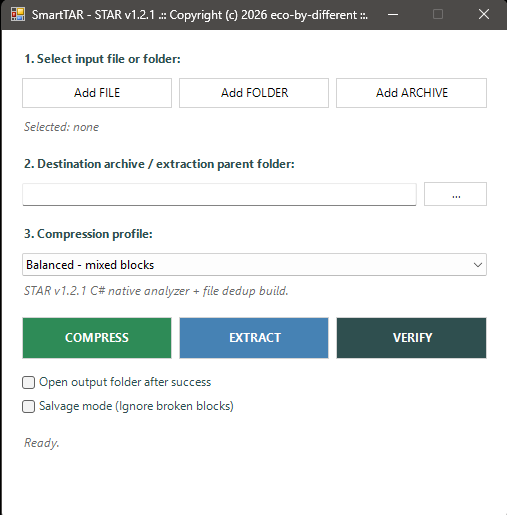

# SmartTAR STAR v1.2.1

## Release Title

**v1.2.1 - C# Native Analyzer, Faster Smart Planning, and Stable STAR v1.2 Compatibility**

---

## Release Notes

SmartTAR STAR v1.2.1 is a performance and maintenance release focused on faster content analysis while preserving full compatibility with the STAR v1.2 archive format.

This release introduces an embedded C# native analyzer for Smart profile planning.  
The analyzer replaces the previous PowerShell byte-level analysis logic and significantly speeds up file classification on larger datasets.

> SmartTAR is not a custom compression engine.  
> It is a smart PowerShell GUI wrapper and STAR container orchestrator built on top of Windows `tar.exe` / `bsdtar`.

The archive format, manifest structure, block layout, verification logic, and extraction behavior remain compatible with STAR v1.2.

---

Antivirus Notice (False Positives): The .exe binary is generated using PS2EXE, which some sensitive antivirus engines (like Windows Defender or Machine Learning models) may flags as a false positive. 
The underlying script is 100% clean. If your system blocks the .exe, you can safely run the raw SmartTAR.ps1 script instead.

---

## Screenshot



---

## Main Highlights

```text
embedded C# native content analyzer
much faster Smart profile planning
legacy PowerShell byte analyzer removed
same STAR v1.2 archive format
same manifest and block layout
same Verify / Extract compatibility
tested Smart, Balanced, Store and Extract workflows
```

---

## C# Native Analyzer

Previous SmartTAR versions performed byte-level content analysis in PowerShell.

SmartTAR STAR v1.2.1 moves the expensive byte analysis logic into embedded C# code.

The native analyzer handles:

```text
sample reading
magic byte detection
zero-byte counting
unique byte counting
entropy calculation
text / binary / archive-like classification
```

This makes the `Smart - max compression` planning phase significantly faster, especially when analyzing many files.

PowerShell remains responsible for:

```text
GUI
workflow orchestration
staging
tar.exe / bsdtar execution
manifest generation
verification
extraction
reporting
```

---

## Smart Profile Behavior

The `Smart - max compression` profile still uses full content analysis.

Current Smart strategy:

```text
structure → XZ9
text      → XZ9
unknown   → XZ9
binary    → XZ9
archives  → STORE
```

Archive-like or already-compressed data is stored without unnecessary recompression.  
Compressible data is grouped and compressed using XZ9.

---

## Compression Profiles

Available profiles:

```text
Balanced - mixed blocks
Smart - max compression
Solid - single block
Store - no compression
```

---

## STAR Format Compatibility

SmartTAR STAR v1.2.1 does not change the STAR archive format.

The internal format remains:

```text
formatVersion = 1
model = STAR v1.2
```

A typical Smart archive layout may contain:

```text
manifest.json
blocks/
  000001_structure.tar.xz
  000002_text.tar.xz
  000003_unknown.tar.xz
  000004_archives.tar
  000005_binary.tar.xz
```

Each block remains a standard tar-compatible unit:

```text
.tar
.tar.xz
.tar.zst
```

The STAR container adds:

```text
manifest metadata
block grouping
block hashing
verification
diagnostics
salvage-friendly structure
```

---

## Validation Summary

SmartTAR STAR v1.2.1 was validated across the main workflows:

```text
Smart - max compression   OK
Balanced - mixed blocks   OK
Store - no compression    OK
Verify                    OK
Extract                   OK
```

The C# analyzer was also compared against the previous PowerShell analyzer and produced matching classification results on tested datasets.

Example validation result:

```text
Source size: 415.37 MB
Archive size: 140.79 MB
Ratio: 33.89 %
Saved: 66.11 %
Verification: OK
```

---

## Design Philosophy

SmartTAR STAR is not intended to replace specialized compression engines.

Instead, SmartTAR focuses on:

```text
smart block planning
content-aware grouping
safe use of Windows tar.exe / bsdtar
clear manifest structure
block-level verification
salvage-friendly archive layout
no external compressor dependencies
```

SmartTAR gets more practical value from the built-in Windows archiving backend through better orchestration.

---

## Summary

SmartTAR STAR v1.2.1 is a faster and cleaner maintenance release for the STAR v1.2 line.

Main improvements:

```text
C# native analyzer
faster Smart planning
removed legacy PowerShell byte analyzer
same STAR v1.2 compatibility
verified archive integrity
stable Verify / Extract behavior
```

This release is the recommended stable v1.2.x build.

---

## License

MIT License

Copyright (c) 2026 Jan Simak

Permission is hereby granted, free of charge, to any person obtaining a copy
of this software and associated documentation files (the "Software"), to deal
in the Software without restriction, including without limitation the rights
to use, copy, modify, merge, publish, distribute, sublicense, and/or sell
copies of the Software, and to permit persons to whom the Software is
furnished to do so, subject to the following conditions:

The above copyright notice and this permission notice shall be included in all
copies or substantial portions of the Software.

THE SOFTWARE IS PROVIDED "AS IS", WITHOUT WARRANTY OF ANY KIND, EXPRESS OR
IMPLIED, INCLUDING BUT NOT LIMITED TO THE WARRANTIES OF MERCHANTABILITY,
FITNESS FOR A PARTICULAR PURPOSE AND NONINFRINGEMENT. IN NO EVENT SHALL THE
AUTHORS OR COPYRIGHT HOLDERS BE LIABLE FOR ANY CLAIM, DAMAGES OR OTHER
LIABILITY, WHETHER IN AN ACTION OF CONTRACT, TORT OR OTHERWISE, ARISING FROM,
OUT OF OR IN CONNECTION WITH THE SOFTWARE OR THE USE OR OTHER DEALINGS IN THE
SOFTWARE.
